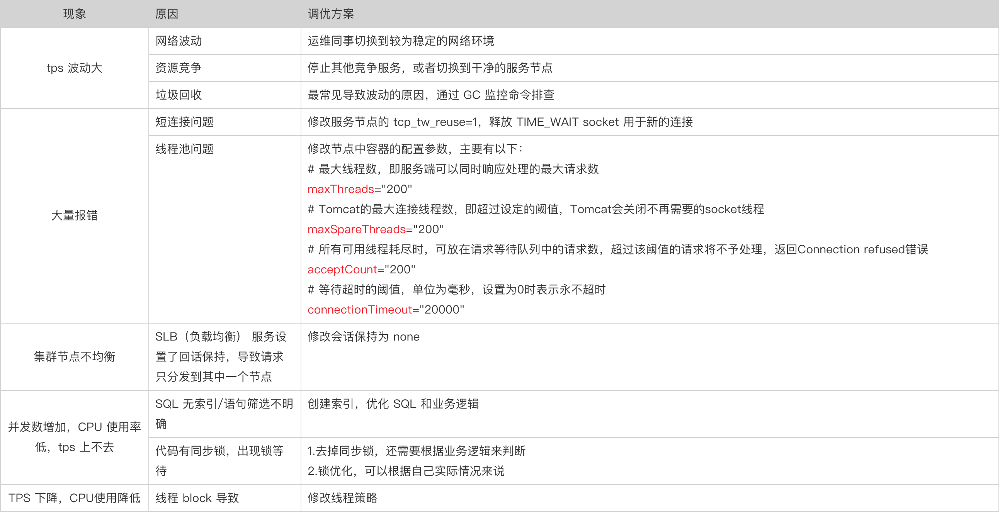
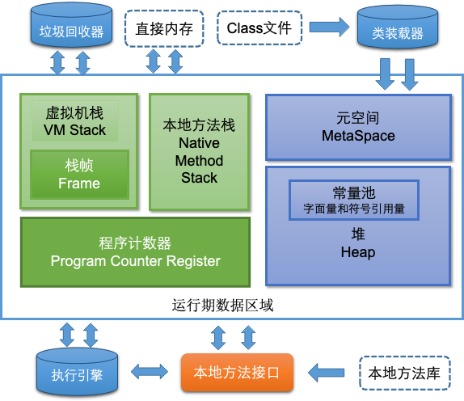

# 软件测试面试问题

本文收录软件测试面试过程中常见的面试题。一些问题是从网上搜罗而来，剔除了不合时宜的；一些则是自己总结的面试题。很多的问题是开放性的，并没有确切的标准答案。

## 基础知识

### 软件测试的目的是什么

在特定在条件对软件进行操作，发现程序中的缺陷，衡量软件质量，评估是否能满足设计要求。

### 软件测试的一般流程
  
1. 项目立项后，参加需求评审，并提出相关修改意见
2. 根据需求文档制定测试用例，然后进行用例评审，用例修改
3. 项目提测后，执行用例，问题记录，及时有效的跟进问题的解决情况
4. 测试环境测试通过后，产品进行验收测试

### 常见的测试类型有哪些

#### 按照测试设计分类

|名称|内容|
|----|----|
|Black box黑盒测试|把软件系统当作一个“黑箱”，无法了解或使用系统的内部结构及知识。从软件的行为，而不是内部结构出发来设计测试。|
|White box白盒测试|设计者可以看到软件系统的内部结构，并且使用软件的内部知识来指导测试数据及方法的选择。|
|Gray box灰盒测试|介于白盒测试与黑盒测试之间的一种测试，灰盒测试多用于集成测试阶段，不仅关注输出、输入的正确性，同时也关注程序内部的情况。|

#### 按照是否需要测试人员操作分类

|名称|内容|
|----|----|
|手动测试|人工测试，比如页面操作的测试|
|自动测试|测试人员编写脚本/代码/工具代替人工，来完成相应测试工作|
|半自动测试|代码或脚本，与人工结合的测试|

#### 按照测试目的分类

|名称|内容|
|----|----|
|功能测试|测试软件产品的功能是否能达到预期|
|接口测试|测试系统组件间接口的一种测试|
|性能测试|通常验证软件的性能在正常环境和系统条件下重复使用是否还能满足性能指标。|
|安全测试|测试系统在防止非授权的内部或外部用户的访问或故意破坏等情况时怎么样|
|兼容测试|测试软件在一个特定的硬件/软件/操作系统/网络等环境下的性能如何。向上兼容向下兼容，软件兼容硬件兼容|

#### 性能测试分类

|名称|内容|
|----|----|
|压力测试|评估应用程序在峰值负载和正常情况下的行为|
|并发测试|并发访问同一个应用、同一个模块或者数据记录时是否存在死锁或其者他性能问题|
|负载测试|负载测试的目的是通过不断地、稳定地增加系统的负载来测试系统，直到达到阈值|
|配置测试|调整软硬件的配置，了解其对系统的性能影响程度，从而找到系统最优配置|

#### 按照是否执行程序分类

|名称|内容|
|----|----|
|静态测试|不运行被测程序本身，仅通过分析或检查源程序的文法、结构、过程、接口等来检查程序的正确性。也包括测试文档。|
|动态测试|通过运行软件来检验软件的动态行为和运行结果的正确性。|

### 测试用例设计常用的方法有哪些?详细说明一下?

黑盒测试用例设计方法包括`等价类划分法`、`边界值分析法`、`错误推测法`、`因果图法`、`判定表驱动法`、`正交试验设计法`、`功能图法`、`场景法`等。
最常用的3种：等价类划分、边界值、错误推断（可以加场景法作为补充）

1. 等价类划分：分为有效等价类和无效等价类，将测试的范围划分成几个互不相交的子集，从每个子集选出若干个有代表性的值作为测试用例
2. 边界值：边界值分析法不仅重视输入条件边界，而且也必须考虑输出域边界。它是对等价类划分方法的补充。
3. 错误推断：基于经验和直觉，以及自己对产品的理解，推测程序中所有可能存在的各种错误，从而有针对性的设计测试用例的方法
4. 场景法：划分不同的场景，然后逐一进行验证

### 解释下单元测试,集成测试,系统测试以及验收测试

1. **单元测试**：通常由开发来完成，对程序类和方法的测试
2. **集成测试**：单元测试完成后，将单元组装成小的模块，对单个模块的测试
3. **系统测试**：各模块测试完成后，对整个系统的完整性测试
4. **验收测试**：测试环境系统测试通过后，由产品或者用户进行验收测试，检查产品的实现是否满足设计的需求

### 软件测试原则有哪些？

- **所有的测试软件测试都应追溯到用户需求**：这是因为软件测试的目的是使用户完成预定的任务，并满足用户的需求，而软件测试的所揭示的缺陷和错误使软件达不到用户的目标，满足不了用户的需求。
- **应当将“尽早地和不断地进行软件测试”作为软件测试者的座右铭**：测试需求贯穿整个软件的生命周期，缺陷修复成本随着各个阶段的靠后而提升。从平时的醒目中已看出，需求阶段引入的bug不比设计阶段少，如何保证好需求的稳定有效已经至关重要。
- **完全测试是不可能地，测试需要终止**：即Zero Bug与Good Enough；本条给我们灌输的是一种测试执行通过的标准。显示任何测试通过不可能达到0bug。那我们就应该达到Good Enough。这条原则是一种权衡投入/产出比的原则：测试既不能不充分也能过，我们需要制定测试通过标准和测试内容，比如：遗留的bug数&严重程度，测试用例的执行率&通过率等来解决上面的问题。
- **软件测试无法显示软件潜在的缺陷**：进行测试时可以查找并报告发现的软件缺陷和错误，但是不能保证软件的缺陷和错误能全部找到，继续进一部测试可能还会找到一些，也就是说测试只能证明软件存在错误而不能证明软件没有错误。
- **充分注意测试中的集群现象**：即80-20原则；这条主要想告诉我们的就是缺陷的集群现象，发现缺陷越多的模块就需要投入更多的人力精力去测试。
- **程序员应避免检查自己的程序**：为了达到测试目的，应由客观、公正、严格的独立的测试部门或者独立的第三方测试机构进行测试。
- **尽量避免测试的随意性**：制定严格的测试计划，并把测试时间安排的尽量宽松，有组织、有计划、有步骤的开展测试活动。
- **回归测试的关联性**：回归测试的关联性一定要引起充分注意。修改一个错误而引起更多错误出现的现象并不少见。
- **关注程序不该做的事**：检查程序应该完成哪些功能，这只是测试工作的一半，测试工作的另一半是，检查程序完成了哪些不应该完成的功能。

### 探索性测试是什么？应该怎么做？

- 在需求文档不完善或者压根没有需求文档的情况下，根据经验进行摸索尝试性进行的测试，是测试过程中形成的基本的思维性测试
- 它是一种`测试风格`而非具体的测试技术，强调独立测试人员的自由和责任，为持续优化工作价值

如何开展探索式测试：

1. 先对软件的单一功能进行比较细致的探索式测试
2. 开展系统交互的探索式测试，基于反馈的探索式测试方法

### 什么是冒烟测试,如何有效的开展冒烟测试?

1. 软件最基本的功能测试，通常由开发完成，只有冒烟点都通过的产品，交由测试，才会比较有意义
2. 冒烟测试贯穿于测试的各个阶段，比如集成测试，系统测试等

### 一条高质量的缺陷记录(Bug)应该具有哪些内容？

1. 记录bug产生的前提条件
2. 产生bug的详细操作步骤
3. bug 产生的模块
4. bug 实际行为与预期行为
5. 截图/视频/日志信息，直观的展示问题，有效帮助开发快速定位问题

### 缺陷的生命周期

新建 -> 提交 -> 分配 -> 修复 -> 验证 -> 验证通过关闭
                                | -> 验证不通过reopen

### Alpha测试与Beta测试的区别

1. Alpha测试：把用户请到开发方的场所来测试，用户在模拟实际操作环境下进行的测试，由开发记录下用户反馈的问题
2. beta测试：当开发和测试根本完成时所做的测试，很多不同的用户，在不同的环境下操作，然后用户把产生的问题，定期发给开发者，进行修复（开发不在现场）
3. 通常先有alpha测试，后有bata测试

### 你认为做好软件测试应该具备哪些素质？

1. 较好的技术能力
2. 对业务逻辑的理解
3. 良好的沟通能力
4. 解决和分析事情的能力

### 作为测试人员,在与开发人员沟通过程中,如何有效的提高沟通效率和效果?

1. 耐心的跟开发沟通，跟他阐述bug的重要性，说服他解决问题
2. 充分尊重对方，哪怕再低级的bug都不要小看他
3. 宽以待人，设身处地为他人着想，即使开发因为压力或者其他原因不肯合作，也要心平气和的跟他沟通
4. 平时多跟开发沟通，无论是工作还是生活上的问题，但是测试一定要有自己的原则，对测试的产品质量负责
5. 自己先定位问题，帮助开发缩小排查范围

### 你觉得软件测试工程师在一个团队中，都需要做什么？有什么价值？

1. 在产品需求评审会上，可以站在用户的角度，提一些贴合用户需求的建议
2. 测试阶段，根据自己对项目的了解和专业的测试技能，尽可能在项目上线前测出更多问题，保证产品质量
3. 对测试过程中出现的问题，合理有效的进行风险评估
4. 对质量严格把关，测试不通过的，一定不能发布生产

### 你对软件测试最大的兴趣是什么?

1. 行业前景比较好，而且近些年越来越多企业更注重测试
2. 测试时间越久，面临的困难和挑战也越多，解决问题的同时，也提高了自身的能力
3. 自己的性格比较外向开朗，很容易跟产品和开发沟通，做起事情可以事半功倍

### 你对自己的职业规划是什么？

1. 管理路线
2. 技术路线

都可以自由发挥，最好贴近自己实际的工作经历，以及个人的性能特征

### 在你以往的工作中，发现的影响大或印象深刻的Bug是什么？为什么？
  
印象深刻的bug：随便举例，最好说出印象深刻的理由

### 在你以往的经历中,解决过的最困难的问题是什么？

环境问题，是所有测试人员都面临的一个难题；解决的那么多问题中，测试环境无法使用，无法快速的介入测试，仍然是比较突出的。曾经把一个长久未使用的环境，根据经验和log定位，各个服务之间的调用，一步步完成调通

### 在你以往的工作或学习中,你最大的收获是什么?学到了什么?

1. 业务的积累，成为某个业务线的业务精英或者业务专家
2. 通过各种自动化，如UI自动化，job自动化，api自动化，不仅提升了自己编码能力，对自动化理解程度与日俱增
3. 长期的测试过程中，提升了自己解决问题的能力，沟通能力，不断提升自己

### 在没有任何文档的情况下,你如何开展测试?

1. 尽量的去获取其他的文档吧，比如开发的一些设计文档---概要设计、功能设计、详细设计
2. 尝试从网上找类似的项目文档，如果幸运，可以从公司的资料库找到类似的文档
3. 按照开发的接口或者设计文档，按照功能模块划分，大致写一些用例，然后进行摸索测试，在测试过程中逐渐完善自己的用例
4. 采用探索式测试方法进行测试

## 测试用例设计

### 测试用例是什么？如何设计有效的测试用例？

为了测试某个产品，编制的一组测试输入、执行条件以及预期结果

1. 明确需求，清晰的知道需求要实现哪些功能
2. 根据需求文档，拆分出功能点和测试测试要点
3. 详细的梳理业务需求，设计不同的业务场景，尽可能多的覆盖，尤其重要的逻辑，颗粒度要精细
4. 具体逻辑的设计方法，遵循边界分析法，出问题最多的就在边界值，然后用等价类划分方法补充一些测试用例
5. UI测试，界面元素测试+样式+操作控件设计+浏览器兼容性相关的用例
6. 时间充足的情况下，设计接口的测试用例，从而保证接口数据的用等价类划分方法补充一些测试用例完整性和正确性--目前携程提倡测试先行的概念，接口要在项目提测前，完成api自动化测试

### 输入三个整数,判断是否构成有效的三角形,针对这个设计测试用例

首先要设计满足三角形的条件，输入的三个数必须大于0，且同时满足任意两边之和大于第三边。假设三条边是A/B/C，则要满足的条件为A>0，B>0，C>0，A+B>C,A+C>B,B+C>A。以此为例来进行设计即可

有效等价类：A>0，B>0，C>0

### 针对文件上传功能，设计测试用例

功能：

1. 常见的文件类型，非可用类型被排除，类型名大小写或者大小写混合
2. 异常文件上传：比如病毒文件，无后缀文件，隐藏文件等等
3. 文件长度限制
4. 文件命名字符限制
5. 文件大小限制
6. 重复上传同一个文件，不同用户上传同一个文件，同一个用户不同 session 下同时上传
7. 上传一个不存在的文件
8. 差异性系统互传，比如 mac 传给 windows服务器，windows 传给 linux服务器
9. 差异性系统互传，检查文本换行符号是否能被识别，mac `\n\t` windows `\n`

兼容：

1. 覆盖使用操作系统：windows/macOS/andriod/iOS/linux
2. 覆盖使用客户端：PC/web/微信/APP/小程序等
3. 覆盖不同设备分辨率
4. 覆盖不同网络：2g 3g 4g 5g wifi 弱网络
5. 覆盖不同语言
6. 兼容热门 APP，兼容系统本身应用

性能：

1. 多时上传多个文件，或者通过工具模拟并发
2. 弱网上传大 size 文件，长时间传输无异常，且 md5 正确
3. 服务器空间不足，上传超过空间的文件

## 测试管理

### 你认为测试经理的工作职责和内容是什么？

1. 负责建立和维护一个有效的测试流程;
2. 负责测试团队的日常管理工作;
3. 负责制定和安排测试计划、测试工作;
4. 带领测试团队进行软件测试工作、按照制定的测试计划执行，并监督和控制测试工作的进程;
5. 负责测试用例的质量，开发高效的测试用例;
6. 负责与其他部门的人员沟通协作，例如与开发人员和项目管理人员进行沟通，共同推动项目的顺利进行;
7. 负责测试团队的培训，培养团队队员的能力。

### 如果你作为测试Leader,你应该怎么建立公司的测试体系并实施它?

### 说明你作为测试团队的负责人，如何提高测试团队的技术能力？

### 列举你以往项目测试中遇到的风险以及你如何处理的？

### 如果当时间不充裕时,该如何安排测试？

1. 跳出这个问题本身：能够讲如何从项目初期就做到避免测试时间不够（如果以前有过很成功的案例是很好的加分项）。
2. 懂得基于风险的测试：如何估算时间，设计测试策略，把`最有限的时间分配在项目风险最大的地方`。这是项非常重要的能力有非常成熟的形式化方法，也有非常多的实战 CheckList（做过大项目的人肯定能够讲出不少条）
3. 如何保证项目状态清晰：让主要干系人随时知道现在项目的状态，特别是质量情况，未来可能的走势，大概什么可能达到发布状态。QA 就像是一个在夜间走山路的汽车的大灯，他的职责就是最及时有效的发现项目所有的大坑，并明确的告诉司机（项目主要干系人）。这里面隐含着对风险管理的能力的考察，也隐含着对沟通能力的考察。
4. 项目管理能力：如何让团队对现状，对现在的项目计划是否能够有效进行下去有一个清晰的认识，并且引导团队 Work Smart 搞定挑战。你不一定是团队 Leader，但在系统测试阶段，从某种意义上 QA 就是项目 Leader。在关键时刻，项目的成败，重要决策是否能够被做出，与负责项目的 QA 有重大关系。
5. 软技能：推动能力，OwnerShip，协调能力，抗压能力，能否激励团队，给团队信心等等。

### 列举你曾经做过的测试(你认为有技术含量的或者提高了测试管理能力的),并说下你从中如何受益？

### 在开发和测试存在不合作甚至对立的情况下，你如何平衡和协调工作？

先简述不合作甚至对立的几个可能原因：

1. 出现的缺陷容易阻塞测试流程的正常进行
2. 修复完并验证完关闭后的bug重复出现
3. 测试人员发现同一个模块缺陷太多，抱怨开发质量太差
4. 轻易复现的bug，开发硬是复现不了
5. 测试时间紧迫
6. 开发提供的文档非常粗略，无法下手测试
7. 开发抱怨测试提过来的bug根本不是bug，而是没有认真查看相关文档
8. 测试提的bug质量不高，没写前提，步骤不清晰，日志截图也没提供等
9. 测试提的bug需要极端情况才出现，用户一般不会这么用
10. 等等

应对方案：

- 从项目立项开始，做好全盘计划，包括需求设计时间，开发编码时间，测试时间，运维部署等等，其中任何一个非测试节点出现延误，都不应该导致测试的时间被压缩
- 制定完整的项目流程，从开发提测的要求，到测试提交bug要求，更加规范和约束开发与测试的行为
- 每一个参加开发的开发人员，和参加测试的测试人员都要尽可能的参加到需求评审会，开发设计，架构设计，测试用例评审会
- 测试人员提供冒烟测试用例给开发，开发执行完再移交给测试人员，测试人员执行冒烟不通过，打回重新开发
- 规范开发提供的文档，提测内容包括文档
- 规范测试提交的bug，规定的提交内容必须有，其他可提供的内容尽可能提供帮助开发更快的定位问题
- 重复reopen的缺陷记录在案，并在项目总结会上提出：适当的施加开发压力
- 阻塞测试流程的bug优先解决
- 不易复现的bug，多复现几次，写明出现概率，以及提供当时的环境和日志信息等
- 更长远的看，开发/测试应该多提高自身的工作质量，提高技术水平，沟通能力，情商等等

## 自动化测试问题

### 你认为适合做自动化测试的标准是什么?

1. 稳定，改动小
2. 核心流程
3. 自动化脚本编写成本低，产出高
4. 需要重复执行的测试用例
5. 中长期项目：某阶段的自动化测试用例可以在下一次的迭代中继续维护使用

### 你认为什么类型的测试不适合做自动化测试?

1. 经常改动
2. 非重要业务流程
3. 短期项目

### UI自动化测试的优点和缺点分别是什么?

优点：

1. 减少手工测试工作量
2. 满足项目的快速迭代
3. 更加贴近用户层面的自动化
4. 增加测试范围：覆盖更多平台或者浏览器等，而无需手工加入

缺点：

1. 修改频繁，维护成本高
2. 投入产出比高

### 在一个项目中目前还没有进行自动化，如果我想开展自动化测试，我应该怎么做(一般步骤)?

项目启动阶段

1. 可行性分析：评估是否适合自动化测试，如果不合适请及时同项目负责人沟通
2. 抽样分析：写几个自动化测试脚本，查看工作能否顺利进行；对自动化测试工作有大体轮廓

测试准备阶段

1. 自动化测试`需求筛选`和`评审`：剔除不重要的测试用例，重点放在核心功能上；UI/API自动化配比：重API轻GUI
2. 制定自动化`测试计划`：组织架构，任务分配，工作量估计，人员分配，进度安排，风险评估，通过准则
3. 制定自动化`测试方案`：目标，范围，工具设计和选择，开发语言选择，自动化框架设计和选择，持续集成规划，UI/API自动化场景与规划，用例设计原则，测试脚本编写原则，测试脚本管理，测试数据管理，自动化测试环境的规划，脚本执行策略
4. `搭建自动化框架`：保证脚本的`分布执行`，用例的模块化，`测试数据管理`，日志分析与错误截图，通俗易懂的`测试报告`，`环境配置化`；提高测试脚本的`可维护性`和`可读性`，测试框架还要做到`高内聚低耦合`
5. 测试用例标准化与制定编码规范：可以参考对应开发语言的编码规范，以及测试框架选择对应的用例设计标准，或者根据平时编码习惯共同商议

### 你认为该如何选择最适合的自动化测试工具?

1. 评估团队是否具备必要技能：技术能力有限团队，优先选择无代码自动化测试工具
2. 团队预算：自动化在短期内性价比较低，要从长远进行规划和计算，为团队带来更多正向的投资回报。
3. 测试需求：需求不同，选择的自动化工具自然各异；另外需要考虑：
   - 支持平台
   - 测试重的应用程序
   - 编码语言
   - CI/CD集成功能
   - 测试报告
4. 脚本维护和可重用性：脚本维护占测试自动化成本重要因素，理想的自动化测试工具应当具备减少维护工作能力；另外可重用性节省编写类似测试用例时间
5. 持续集成能力：集成到CI/CD管道和外部平台，确保测试的连续性，确保更好的进行测试管理和团队协作
6. 技术支持：商业工具，依靠商业技术支持；而开源则依靠庞大而活跃的社区

### 什么是自动化测试框架?一个好的自动化测试框架应该具备什么元素?

- 定义：为解决某些特定问题而约束边界，支撑整个问题解决方案，配套了一些解决问题的组件而构成的工具
- 具备元素：
    1. 简化测试执行过程
    2. 提高测试机器的执行效率
    3. 提供测试用例并发执行能力
    4. 提供CI/CD集成机制
    5. 日志记录和管理能力
    6. 环境可配置，参数可配置
    7. 公共方法/函数，常用操作
    8. 结果统计能力
    9. 优雅的测试报告

### 说一下你写过的测试框架的代码目录结构是怎么样的?

简单举例junit项目的目录结构：

- test：不同测试场景下的自动化用例；公共方法类，比如文件读写，字符串处理等；
- resources：配置文件，一般是xml文件

### 自动化测试框架的类型有哪些?

### 说一下你在实施自动化测试过程中好的代码实践?

### 自动化测试是否仅仅可以是实施在UI层?为什么?

仅仅实施在UI层面是非常不明智不可取的。

UI变更频率更高，细小的改动也会导致测试脚本大范围的改动，维护成本太大；而API自动化执行效率更高，并且修改相对较小，出错率低，可测试的覆盖率也比UI高，应当将自动化测试重点放在API上。

### 你是否熟悉Selenium工具?说一下它是什么?

### 你是否还熟悉其它的自动化测试工具?各自简单的介绍一下?

## 安全测试

### 什么是安全测试

软件安全测试是确认软件的安全特性实现是否与预期设计一致的过程。软件安全性测试是在软件的生命周期内采取的一系列措施，用来防止出现有违反安全策略的异常情况和在软件的设计、开发、部署、升级以及维护过程钟的潜在系统漏洞。

与传统测试最大的区别在于：强调软件不应当做什么，而不是软件要做什么。

### 安全测试的目标

1. 通常的目标：内存溢出，SQL 注入/XSS，各种输入验证问题
2. 进一步的目标：访问控制，信息泄露，不充分的随机数，鉴别与加密

### 安全测试有哪些方法

- 白/灰盒测试：对软件工程文档/源代码/二进制代码进行静态分析/审核，对运行时系统进行动态监测
- 功能验证：功能验证是采用软件测试当中的黑盒测试方法，对涉及安全的软件功能，如：用户管理模块、权限管理、加密系统、认证系统等进行测试，主要验证上述功能是否有效
- 漏洞扫描：安全漏洞扫描主要是借助于特定的漏洞扫描器完成的。通过使用漏洞扫描器，系统管理员能够发现系统存在的安全漏洞，从而在系统安全中及时修补漏洞的措施。分为两种类型：主机漏洞扫描器是指在系统本地运行检测系统漏洞的程序；网络漏洞扫描器是指基于网络远程检测目标网络和主机系统漏洞的程序
- 模拟攻击：对于安全测试来说，模拟攻击测试是一组特殊的极端的测试方法，以模拟攻击来验证软件系统的安全防护能力

### cookie session token 区别

他们存在的原因是因为，http 是`无状态连接`，用户的信息需要被保存起来，也就是通过技术手段使得前后两次的请求有一定的关系。

- cookie: 类似一个令牌，装有 sessionId，存储在客户端，浏览器通常会自动添加
- session: 存储在服务器中，理解为一个状态列表，拥有一个唯一的标识符 sessionId；通常是`存放在 cookies` 中。服务器收到 cookie后解析出 sessionId，再去列表中查找对应的 session。
- token: 类似一个令牌，无状态（服务器端并不会保存用户认证相关的信息），用户信息加密到 token 中，服务器收到 token 后会解密，就能知道是哪一个用户。需要开发者手动添加。

参考《[彻底弄懂session，cookie，token](https://segmentfault.com/a/1190000017831088)》

### 如何避免 SQL 注入

- 严格限制 web 应用的数据库操作权限
- 使用正则表达式过滤字符串中的特殊字符
- 对进入数据库的特殊字符进行转义处理或者编码转换
- 所有查询语句建议使用数据库提供的参数化查询接口
- 应用发布之前建议使用专业的 sql 注入检查工具
- 避免网站打印出 sql 错误信息

### 什么是 CSRF 攻击，如何预防

定义：跨站请求伪造。攻击者利用受害者的身份，以受害者的名义发起恶意请求

预防：

1. 请求中嵌入一些额外的授权数据，区分哪些是未授权的请求
2. Synchronizer token pattern - 用户请求嵌入token，服务器验证token
3. Cookie-to-Header Token - 对于JS交互网站，token置于cookie中，js读取token，请求时将token作为header
4. 验证码 - 重要操作，需要用户输入验证码再次确认

## 性能测试

### 什么是性能测试?为什么要进行性能测试?

性能测试是通过自动化的测试工具模拟多种正常、峰值以及异常负载条件来对系统的各项性能指标进行测试。

性能测试的`目标`：

1. 评估系统的能力，测试中得到的负荷和响应时间数据可以被用于验证所计划的模型的能力，并帮助作出决策。
2. 识别体系中的弱点：受控的负荷可以被增加到一个极端的水平，并突破它，从而修复体系的瓶颈或薄弱的地方。
3. 系统调优：重复运行测试，验证调整系统的活动得到了预期的结果，从而改进性能。
4. 检测软件中的问题：长时间的测试执行可导致程序发生由于内存泄露引起的失败，揭示程序中的隐含的问题或冲突。
5. 验证稳定性（resilience）可靠性（reliability）：在一个生产负荷下执行测试一定的时间是评估系统稳定性和可靠性是否满足要求的唯一方法。

### 性能测试的类型有哪些?

|名称|内容|
|----|----|
|压力测试|评估应用程序在峰值负载和正常情况下的行为|
|并发测试|并发访问同一个应用、同一个模块或者数据记录时是否存在死锁或其者他性能问题|
|负载测试|负载测试的目的是通过不断地、稳定地增加系统的负载来测试系统，直到达到阈值|
|配置测试|调整软硬件的配置，了解其对系统的性能影响程度，从而找到系统最优配置|

### 列举用户会面对的性能问题和性能瓶颈

软件工程中，应用程序或者系统的容量通常会因为单个组件的限制，出现瓶颈，瓶颈在事物路径的所在部分中具有最低的吞吐量。系统设计人员尝试避免瓶颈，并直接努力查找和调整现有瓶颈。可能的瓶颈：处理器，通信链路，磁盘 IO 等。

- 硬件

|缺陷|描述|
|--|--|
|磁盘|磁盘空间不足，磁盘读写慢|
|CPU|占用过高，程序运行变慢|
|IO 读写速率|数据处理时的 I/O 速率，页交换等|
|内存|占用过高，程序运行变慢|

- 网络

|缺陷|描述|
|--|--|
|带宽|网络资源竞争，超时|
|延时|物理层面的延时，无法避免，但可减轻|
|丢包|硬件故障，线路故障，网络拥塞|

- 应用

|缺陷|描述|
|--|--|
|JVM|1.堆内存分配：一般不超过系统内存的 25%  2.垃圾回收算法：根据具体情况选择合适的垃圾回收策略 3.OOM：内存泄露，GC不完整，内存耗尽|
|代码层|不合理的线程引用和内存分配|
|JDK 版本|尽可能和生产环境版本一致|
|底层配置|OS，服务器硬件的配置不合理，带来的性能瓶颈|
|参数配置|系统架构设计，不同参数配置带来的性能瓶颈|

- 数据库

|缺陷|描述|
|--|--|
|索引|合适的索引，减少磁盘 IO 与数据库执行时间|
|锁|并发场景下的表锁，行锁，页锁|
|表空间|不合理的表结构设计|
|慢 SQL|1.未命中索引 2.select *  3.like %  4.使用大事务的 SQL|
|数据量|数据量不同，性能差异大|

- 中间件

|缺陷|描述|
|--|--|
|超时|设置合理的超时时间，需要配置测试来设定|
|线程池|太小，容易被使用完 太大，造成浪费，配置测试来设定|
|缓存策略|缓存失效，缓存穿透|
|最大连接数|连接数少导致队列等待、超时，多则浪费资源|
|通信方式|同步或者异步|
|负载均衡|集群，负载均衡策略选择|

### 列举下性能测试中常涉及的性能计数?

1. 资源指标
　　- CPU使用率：指用户进程与系统进程消耗的CPU时间百分比，长时间情况下，一般可接受上限不超过85%。
　　- 内存利用率：内存利用率=(1-空闲内存/总内存大小)*100%，一般至少有10%可用内存，内存使用率可接受上限为85%。
　　- 磁盘I/O: 磁盘主要用于存取数据，因此当说到IO操作的时候，就会存在两种相对应的操作，存数据的时候对应的是写IO操作，取数据的时候对应的是是读IO操作，一般使用% Disk Time(磁盘用于读写操作所占用的时间百分比)度量磁盘读写性能。
　　- 网络带宽：一般使用计数器Bytes Total/sec来度量，Bytes Total/sec表示为发送和接收字节的速率，包括帧字符在内。判断网络连接速度是否是瓶颈，可以用该计数器的值和目前网络的带宽比较。

2.系统指标
　　- 并发用户数：某一物理时刻同时向系统提交请求的用户数。
　　- 在线用户数：某段时间内访问系统的用户数，这些用户并不一定同时向系统提交请求。
　　- 平均响应时间：系统处理事务的响应时间的平均值。事务的响应时间是从客户端提交访问请求到客户端接收到服务器响应所消耗的时间
　　- 90%响应时间：所有样本的响应时间按照从小到大排列，取全部的第90%位的数值作为响应时间，该值在Jmeter也是一种标准统计指标（This is a standard statistical measure）。如果面试问到使用平均还是90%，尽可能答`90%`，或者把两者都说出来并带出两者时间的差异
　　- 事务成功率：性能测试中，定义事务用于度量一个或者多个业务流程的性能指标，如用户登录、保存订单、提交订单操作均可定义为事务
　　- 超时错误率：主要指事务由于超时或系统内部其它错误导致失败占总事务的比率
　　- 吞吐率：样本数量除以计数时间；三种计数方式:页面/s、请求数/s、Bytes/s，不同场景采取方式不同，或者同时使用多个

### 性能测试中并发用户点击量是什么?如何实现?

并发用户点击量：通过工具模拟用户的操作来实现多个用户同时使用系统的场景。

通过Jmeter添加多线程，然后线程数设置>1，再添加该任务对应的请求、断言等，启动即可。

### 性能测试进入和结束的标准是什么?

性能测试与其他测试活动一样，都是需要需求的提出与相应的评审活动的。

需求阶段

- 提出需求：产品人员，开发人员，测试人员，运维人员都可以提出
- 需求评审：这一步是出具测试计划的关键
- 需求调研：主要是对测试实施细节沟通和确认

在需求阶段需要评估该性能需求可行性，资源调配，细节再次确认。再三确认可行后，便是进入性能测试的号角。

结束标志：测试场景测试完毕、发现的问题已全部修复、结果达到预期、满足上线要求，并且出具对应的测试报告。

### 说一下在选择性能测试工具之前需要考虑哪些东西?

1. 根据压测场景：根据压测场景是什么来选择。如果说是一次性单接口的场景就可以使用 AB。如果说是复杂事物多接口需要业务场景的话，就会选择 JMeter 这类工具可以构造丰富的场景能满足需求。
2. 需要提供多大压力：是1000 QPS还是万级以上的。压力很大的话就要考虑压力测试工具是否支持分布式，能否快速扩展 agent。对于 JMeter 来讲就很好的支持了。
3. 周期性需求：业务可能频繁上线，服务随时变动。可能会有一个周期性需求，按月巡检。需要一个场景文件，可以去做数据驱动，实时跟进数据改变。最后希望结果落库。
4. 二次开发需求：JMeter 开源插件化思想，支持 Thrift，Dubbo 等多种协议。可以快速平台化。
5. 问题支持：是否具备完善的文档支持，是否具备强大的开放社区，是否已广泛使用，工具成熟度等，有问题的时候能够快速获得答案。

### 在性能测试中,如何识别性能瓶颈?

### 在对应用程序进行性能测试期间一般会执行哪些活动?

|工作内容|描述|
|--|--|
|环境准备|运维提供适当的物理服务器或者虚拟机环境|
|应用部署|开发提供无明显功能缺陷的代码分支，运维帮忙部署到对应的测试服务器|
|数据准备|铺底数据：作为基础数据，模拟真实环境数据量 测试数据：用来发起并发的数据，可以事先准备或者动态生成 参数化数据：数据多样化，覆盖尽可能多的业务场景|
|脚本开发|针对性能测试工具进行对应的脚本开发，覆盖对应的测试场景|
|压测执行|不断执行压测脚本，以及脚本调整，改进测试结果|
|服务监控|狭义：单应用的监控，接口性能和错误监控，分布式调用链接追踪，其他用户诊断（内存，线程）的监控信息 广义：APP端监控，网页端监控，容器/服务器监控，其他中间件、数据库层面的监控|
|瓶颈定位|对日志，监控数据进行分析，定位瓶颈并做出优化|
|优化验证|对优化的软件再次执行压测，验证问题是否已经得到解决或者性能得到提升，标准是需求评审阶段的业务性能指标|

### 性能测试中吞吐量是什么?

在一次性能测试活动中网络传输的数据量的总和。吞吐量一般是不具备参考价值的，应当用吞吐率。

吞吐率：单位时间内传输的数据量，可以用 页面/s、请求/s、Bytes/s等来统计。一般针对不同场景下的性能测试要求来使用不同的统计方式。

### 解释下什么是耐力测试和尖峰测试?

耐力测试：有时也叫浸泡测试，是一种非功能性测试。耐力测试是`长时间测试具有预期负载量的系统`，以验证系统的行为是否正常。

尖峰测试：尖峰测试用于确定系统在负载（比如用户请求数）突然变化时的系统行为。这种测试是通过突然增加或减少由用户产生的负载来观察系统的行为。测试的目标是确定性能在这样的场景下是否会受损，系统是否会失败，或者是否能够处理负载的显著变化。尖峰测试的核心是负载变化的突然性，所以也算是一种压力测试。

## 数据库问题

### 一张表,里面有ID自增主键,当insert了17条记录之后,删除了第15,16,17条记录,再把Mysql重启,再insert一条记录,这条记录的ID是18还是15

若是没有修改过 id 自增的初始值，则是从 18 开始，若修改为其他，则从该修改后的 id 开始

### 数据库三范式

1. 第一范式：强调的是列的原子性，即数据库表的每一列都是不可分割的原子数据列
2. 第二范式：在第一范式的基础上，非主键列完全依赖于主键，而不能依赖于主键的一部分
3. 第三范式：在第二范式的基础上，非主键列只依赖主键，不依赖于其他非主键

### 事务四性质

1. 原子性：一个事务在所有操作要么全部成功，要么全部不完成（相当于未发起事务）
2. 一致性：在事务开始前后，数据库的整体结构没有被破坏
3. 隔离性：允许并发事务对数据库进行读写和修改，而相互不影响
4. 持久性：对数据库的修改是永久的

### mysql 内连接 左连接 右连接

- 内连接：join = inner join，两表共同部分
- 左连接：left join，左表 + 匹配部分
- 右连接：right join，右表 + 匹配部分

### 最左匹配原则

mysql 会一直向右匹配直到遇到范围查询 `>`, `<`, between, like 就停止匹配。比如`where a = 1 and b = 2 and c > 3 and d = 4` 如果建立(a,b,c,d)顺序的索引，d是用不到索引的。如果建立(a,b,d,c)则可以用到 a,b,d的组合索引，并且 a,b,d 的顺序可以随意调整。

再解释一下 `a,b,c 索引` 实际上等于创建 `a 索引`，`a,b 索引`， `a,b,c 索引`

### 什么是索引，有什么用

索引的概念：

- **简单**：一种将数据库中的记录按照特殊形式存储的数据结构
- **专业**：排序列表，表中存储着索引值和包含这个值所在行的物理地址

作用：

1. 将随机 IO 变成顺序 IO
2. 帮助服务器避免排序和创建临时表
3. 大大减少服务器需要扫描的数据量

## 操作系统问题

### 列出超过10个Linux常用的命令以及其作用?

### 进程和线程是什么?它们有什么区别和联系?

|差别|进程|线程|
|--|--|--|
|定义|程序在某数据集合上一次运行活动|进程中一个执行路径|
|角色|系统资源分配的单位|系统调度的单位|
|资源|不同进程资源不能共享|共享同一个进程地址空间和其他资源 线程有自己的栈和栈指针，程序计数器等寄存器|
|独立性|独立的地址空间|必须依赖进程而存在|

## 算法问题

## Java面试题

### 面向对象三特征

1. 继承：继承是使用已存在的类作为基础--建立新类的技术，新类的定义可以增加新的数据或新的功能，也可以用父类的功能，但不能选择性地继承父类。通过使用继承我们能够非常方便地复用以前的代码，能够大大的提高开发的效率
2. 封装, 把数据和逻辑封装在类里，通过创建对象去访问这个类里的方法和属性，封装把一个对象的属性私有化，同时提供一些可以被外界访问的属性的方法，作用：可以更改好的保护类的内部成员
3. 多态性
    - 依赖继承，重写方法
    - 同一行为具有不同的实现，通过继承父类，在子类中进行方法的实现
    - 通过创建不同子类的对象，去调用不同的方法

### 重写和重载的区别是什么？为什么重载不能根据返回值判断？

`重写`：@Override（不同类），用于子类继承父类，在子类去重写方法，对父类进行扩充或改造。父类的方法只有是public或者protected的，子类才能重写方法，其他的如父类是私有或者default，子类都是不可见的，所以不能重写方法。子类的方法名，参数，返回值都跟父类相同，重写的方法修饰符大于等于父类的方法

`重载`：同一个类中，存在相同的方法名，但是方法的参数一定不同

### 为什么重载不能根据返回值判断？

因为如果根据返回值判断，那么编译器编译的时候，如果参数相同，就不知道调用哪个方法了

### 访问修饰符public，private，protected以及默认之间的区别

类的成员不写访问修饰时默认为default。默认对于同一个包中的其他类相当于公开（public），对于不是同一个包中的其他类相当于私有（private）。受保护（protected）对子类相当于公开，对不是同一包中的没有父子关系的类相当于私有。Java中，外部类的修饰符只能是public或默认

### 抽象类和接口的异同？

构造函数：抽象类可以有；接口不能有

方法实现：java8之前接口不可有方法实现，值可有方法签名；抽象类可以有非抽象的方法

修饰符：接口方法默认是public；抽象类可以是public、protected、default

设计层面：抽象是对象的抽象，是一种模板设计；接口是对行为的抽象，是一种行为规范

### Java中的异常有哪几类？分别怎么使用？

受检异常和非受检异常。

受检异常：必须在代码里面主动捕获或者在方法签名里抛出

非受检异常：runtime异常，不需要主动捕获或者抛出

一般来说Error不属于异常，而是属于`错误`，会导致程序异常或者停止。

### 常用的集合类有哪些以及各自有什么特点?

Map: key value 映射集合，key不可以重复

List: 单元素集合，元素不可重复，且可以为null

Set: 单元素集合，元素不可重复，不可以为null

Queue：队列，先进先出

### ArrayList和LinkedList内部的实现大致是怎样的？他们之间的区别和优缺点？

数据结构：A为数组，内存连续；L为链表，内存不连续，从它的命名很好判断

访问效率：A比L随机访问效率高，因为L是线性数据存储

增删效率：非首尾增删，L比A效率高，因为A会涉及到元素移位

使用场合：读多用A，增删多用L

### 内存溢出是怎么回事？请举几个可能出现内存溢出的场景？

`内存溢出`(Out Of Memory，简称OOM)是指应用系统中存在无法回收的内存或使用的内存过多，最终使得程序运行要用到的内存大于能提供的最大内存。

内存溢出场景：

1. 堆内存溢出：启动JVM时，堆内存最大内存配置比较小，在对象初始化的时候，超过堆内存最大值（本来应该将对象放置于新生代，但是由于新生代内存不够放），导致堆内存溢出
2. 堆内存泄露：正常情况下，对象如果没有被root路径引用，则会被GC，但是由于错误的引用而导致某些对象无法被GC，而无限期存在堆内存中
3. 栈内存溢出：线程都有自己私有的栈，每一个方法都会在栈内创建栈帧，若是方法存在递归，则会导致栈顶部生成新的栈帧，从而可能导致栈内存溢出
4. 直接内存溢出：非JVM内部内存，在程序内不断分配直接内存，而并未正常回收时会导致该问题

### ==和equals的区别？

==：基础数据类型比较数值是否相等；而引用类型比较的是两者的地址是否一样

equals：本质上同==一致，部分引用类型重写equals方法，对应的值相等即可

### hashCode方法的作用是什么？

hashCode()方法的默认行为是堆上的对象产生独特值；重写该方法可以使得地址不等的两个对象也可通过eqauls()方法判断为相等。若是不重写，则同类的不同实例一定不等。

### HashMap实现原理，如何保证HashMap的线程安全？

[Java-HashMap工作原理](https://yikun.github.io/2015/04/01/Java-HashMap%E5%B7%A5%E4%BD%9C%E5%8E%9F%E7%90%86%E5%8F%8A%E5%AE%9E%E7%8E%B0/)

如何保证HashMap线程安全：

- 使用 java.util.Hashtable 类，此类是线程安全的。
- 使用 java.util.concurrent.ConcurrentHashMap，此类是线程安全的。推荐！
- 使用 java.util.Collections.synchronizedMap() 方法包装 HashMap object，得到线程安全的Map，并在此Map上进行操作。
- 自己在程序的关键方法或者代码段加锁，保证安全性，当然这是严重的不推荐。

### Java中一个字符占多少个字节，扩展再问int, long, double占多少字节

|类型|占用字节|占用位数|
|--|--|--|
byte|1|8
short|2|16
int|4|32
long|8|64
float|4|32
double|8|64
char|2|16

- `boolean类型`被编译为int类型，等于是说JVM里占用字节和int完全一样，int是4个字节，于是boolean也是4字节
- `boolean数组`在Oracle的JVM中，编码为byte数组，每个boolean元素占用8位=1字节

### 创建一个类的实例都有哪些办法？

1. 用new 语句创建对象，这是最常用的创建对象方法
2. 运用反射手段，调用Java.lang.Class或者java.lang.reflect.Constructor类的newInstance()实例方法
3. 调用对象的clone()方法
4. 运用反序列化手段，调用java.io.ObjectInputStream对象的readObject()方法。

### final/finally/finalize的区别？

final: 修饰符，类上不可被集成，方法上不可以被重写，变量上不可以被重新赋值（不可以指向另外的内存地址）

finally：用在 try catch finally 异常处理上

finalize：对象销毁的时候，调用的方法，一般来说不需要另外申明该方法

### String/StringBuffer/StringBuilder的区别?

String：不可变对象

StringBuffer/StringBuilder：可变对象，前者线程安全，后者线程不安全

### 什么是java序列化，如何实现java序列化?

将Java对象转变成可以传输的IO数据流。

|实现Serializable接口|实现Externalizable接口|
|--|--|
|系统自动存储必要的信息|程序员决定存储哪些信息|
|Java内建支持，易于实现，只需要实现该接口即可，无需任何代码支持|必须实现接口内的两个方法|
|性能略差|性能略好|

虽然Externalizable接口带来了一定的性能提升，但变成复杂度也提高了，所以一般通过实现Serializable接口进行序列化。

作者：9龙
链接：https://juejin.cn/post/6844903848167866375

## JVM

### JVM内存结构，为什么需要GC？

若不进行垃圾回收，则回导致内存溢出，是的系统无法正常运作

### JVM堆的基本结构

### JVM的垃圾算法有哪几种？CMS垃圾回收的基本流程？

### JVM有哪些常用启动参数可以调整，描述几个？

### 如何查看JVM的内存使用情况？

### 你常用的JVM配置和调优参数都有哪些？分别什么作用？
