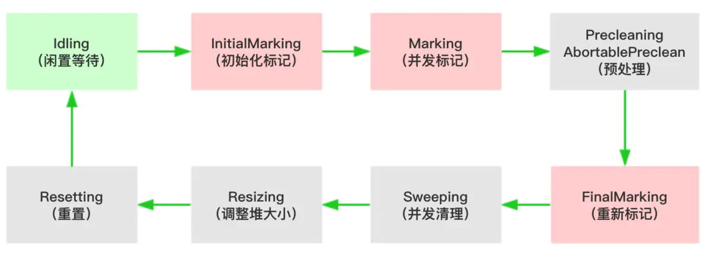

# Java面试题

一般而言，如果是面试的测试开发岗位，或者测试自动化岗位，可能会根据你简历上面的项目经历提问有关 Java 的问题；如果不是上述岗位可以不用深究，稍微看一下即可。

## 面向对象三特征

1. 继承：继承是使用已存在的类作为基础--建立新类的技术，新类的定义可以增加新的数据或新的功能，也可以用父类的功能，但不能选择性地继承父类。通过使用继承我们能够非常方便地复用以前的代码，能够大大的提高开发的效率
2. 封装, 把数据和逻辑封装在类里，通过创建对象去访问这个类里的方法和属性，封装把一个对象的属性私有化，同时提供一些可以被外界访问的属性的方法，作用：可以更改好的保护类的内部成员
3. 多态性
    - 依赖继承，重写方法
    - 同一行为具有不同的实现，通过继承父类，在子类中进行方法的实现
    - 通过创建不同子类的对象，去调用不同的方法

## 重写和重载的区别是什么？为什么重载不能根据返回值判断？

`重写`：@Override（不同类），用于子类继承父类，在子类去重写方法，对父类进行扩充或改造。父类的方法只有是public或者protected的，子类才能重写方法，其他的如父类是私有或者default，子类都是不可见的，所以不能重写方法。子类的方法名，参数，返回值都跟父类相同，重写的方法修饰符大于等于父类的方法

`重载`：同一个类中，存在相同的方法名，但是方法的参数一定不同

## 为什么重载不能根据返回值判断？

因为如果根据返回值判断，那么编译器编译的时候，如果参数相同，就不知道调用哪个方法了

## 访问修饰符public，private，protected以及默认之间的区别

类的成员不写访问修饰时默认为default。默认对于同一个包中的其他类相当于公开（public），对于不是同一个包中的其他类相当于私有（private）。受保护（protected）对子类相当于公开，对不是同一包中的没有父子关系的类相当于私有。Java中，外部类的修饰符只能是public或默认

## 抽象类和接口的异同？

构造函数：抽象类可以有；接口不能有

方法实现：java8之前接口不可有方法实现，值可有方法签名；抽象类可以有非抽象的方法

修饰符：接口方法默认是public；抽象类可以是public、protected、default

设计层面：抽象是对象的抽象，是一种模板设计；接口是对行为的抽象，是一种行为规范

## Java中的异常有哪几类？分别怎么使用？

受检异常和非受检异常。

受检异常：必须在代码里面主动捕获或者在方法签名里抛出

非受检异常：runtime异常，不需要主动捕获或者抛出

一般来说Error不属于异常，而是属于`错误`，会导致程序异常或者停止。

## 常用的集合类有哪些以及各自有什么特点?

Map: key value 映射集合，key不可以重复

List: 单元素集合，元素不可重复，且可以为null

Set: 单元素集合，元素不可重复，不可以为null

Queue：队列，先进先出

## ArrayList和LinkedList内部的实现大致是怎样的？他们之间的区别和优缺点？

数据结构：A为数组，内存连续；L为链表，内存不连续，从它的命名很好判断

访问效率：A比L随机访问效率高，因为L是线性数据存储

增删效率：非首尾增删，L比A效率高，因为A会涉及到元素移位

使用场合：读多用A，增删多用L

## ==和equals的区别？

==：基础数据类型比较数值是否相等；而引用类型比较的是两者的地址是否一样

equals：本质上同==一致，部分引用类型重写equals方法，对应的值相等即可

## hashCode方法的作用是什么？

hashCode()方法的默认行为是堆上的对象产生独特值；重写该方法可以使得地址不等的两个对象也可通过eqauls()方法判断为相等。若是不重写，则同类的不同实例一定不等。

## HashMap实现原理，如何保证HashMap的线程安全？

[Java-HashMap工作原理](https://yikun.github.io/2015/04/01/Java-HashMap%E5%B7%A5%E4%BD%9C%E5%8E%9F%E7%90%86%E5%8F%8A%E5%AE%9E%E7%8E%B0/)

如何保证HashMap线程安全：

- 使用 java.util.Hashtable 类，此类是线程安全的。
- 使用 java.util.concurrent.ConcurrentHashMap，此类是线程安全的。推荐！
- 使用 java.util.Collections.synchronizedMap() 方法包装 HashMap object，得到线程安全的Map，并在此Map上进行操作。
- 自己在程序的关键方法或者代码段加锁，保证安全性，当然这是严重的不推荐。

## Java中一个字符占多少个字节，扩展再问int, long, double占多少字节

|类型|占用字节|占用位数|
|--|--|--|
byte|1|8
short|2|16
int|4|32
long|8|64
float|4|32
double|8|64
char|2|16

- `boolean类型`被编译为int类型，等于是说JVM里占用字节和int完全一样，int是4个字节，于是boolean也是4字节
- `boolean数组`在Oracle的JVM中，编码为byte数组，每个boolean元素占用8位=1字节

参考《[Java中boolean类型占几个字节，你知道吗？](https://amoschen.blog.csdn.net/article/details/97377833)》

## 创建一个类的实例都有哪些办法？

1. 用 new 语句创建对象，这是最常用的创建对象方法
2. 运用反射手段，调用Java.lang.Class或者java.lang.reflect.Constructor类的newInstance()实例方法
3. 调用对象的clone()方法
4. 运用反序列化手段，调用java.io.ObjectInputStream对象的readObject()方法。

## final/finally/finalize的区别？

final: 修饰符，类上不可被集成，方法上不可以被重写，变量上不可以被重新赋值（不可以指向另外的内存地址）

finally：用在 try catch finally 异常处理上

finalize：对象销毁的时候，调用的方法，一般来说不需要另外申明该方法

## String/StringBuffer/StringBuilder的区别?

String：不可变对象

StringBuffer/StringBuilder：可变对象，前者线程安全，后者线程不安全

## 什么是java序列化，如何实现java序列化?

将Java对象转变成可以传输的IO数据流。

|实现Serializable接口|实现Externalizable接口|
|--|--|
|系统自动存储必要的信息|程序员决定存储哪些信息|
|Java内建支持，易于实现，只需要实现该接口即可，无需任何代码支持|必须实现接口内的两个方法|
|性能略差|性能略好|

虽然Externalizable接口带来了一定的性能提升，但变成复杂度也提高了，所以一般通过实现Serializable接口进行序列化。

作者：9龙
链接：https://juejin.cn/post/6844903848167866375

## 内存溢出是怎么回事？请举几个可能出现内存溢出的场景？

`内存溢出`(Out Of Memory，简称OOM)是指应用系统中存在无法回收的内存或使用的内存过多，最终使得程序运行要用到的内存大于能提供的最大内存。

内存溢出场景：

1. 堆内存溢出：启动JVM时，堆内存最大内存配置比较小，在对象初始化的时候，超过堆内存最大值（本来应该将对象放置于新生代，但是由于新生代内存不够放），导致堆内存溢出
2. 堆内存泄露：正常情况下，对象如果没有被root路径引用，则会被GC，但是由于错误的引用而导致某些对象无法被GC，而无限期存在堆内存中
3. 栈内存溢出：线程都有自己私有的栈，每一个方法都会在栈内创建栈帧，若是方法存在递归，则会导致栈顶部生成新的栈帧，从而可能导致栈内存溢出
4. 直接内存溢出：非JVM内部内存，在程序内不断分配直接内存，而并未正常回收时会导致该问题

## JVM内存结构，为什么需要GC？

内存结构参考上一个题目。

随着程序的运行，内存中的实例对象、变量等占据的内存越来越多，如果不及时进行回收，会降低程序运行效率，甚至引发系统异常。

## JVM的垃圾算法有哪几种？

- 串行（Serial）回收器是单线程的一个回收器，简单、易实现、效率高。
- 并行（ParNew）回收器是Serial的多线程版，可以充分的利用CPU资源，减少回收的时间。
- 吞吐量优先（Parallel Scavenge）回收器，侧重于吞吐量的控制。
- 并发标记清除（CMS，Concurrent Mark Sweep）回收器是一种以获取最短回收停顿时间为目标的回收器，该回收器是基于“标记-清除”算法实现的。

## CMS垃圾回收的基本流程？

- 初始标记(CMS-initial-mark)，会导致stop-the-world;
- 并发标记(CMS-concurrent-mark)，与用户线程同时运行；
- 预清理（CMS-concurrent-preclean），与用户线程同时运行；
- 可被终止的预清理（CMS-concurrent-abortable-preclean） 与用户线程同时运行；
- 重新标记(CMS-remark) ，会导致swt；
- 并发清除(CMS-concurrent-sweep)，与用户线程同时运行；
- 并发重置状态等待下次CMS的触发(CMS-concurrent-reset)，与用户线程同时运行；

其运行流程图如下所示：

参考《[CMS垃圾收集器](https://juejin.cn/post/6844903782107578382)》

## JVM有哪些常用启动参数可以调整，描述几个？

|参数|描述|
|--|--|
|\-Xmx512m|设置最大堆内存|
|\-Xms512m|设置初始堆内存|
|\-Xmn256m|设置年轻代内存|
|\-XX:+PrintGC 或者-verbose:gc|开启简单GC日志|
|\-XX:+PrintGCDetails|开启详细GC日志|
|\-XX:+PrintGCDateStamps|打印GC日期时间|
|\-XX:+PrintGCTimeStamps|打印GC基准时间,基于应用启动时间偏移|
|\-Xloggc:gc.log|GC日志存放目录|
|\-XX:NewRatio=2|老年代与新生代的比值为2,老年代是新生代的2倍,默认值是2|
|\-XX:SurvivorRatio=8|eden代与suvivor代的比值,默认值是8|
|\-ea|设置jvm启用断言assert机制,默认是关的|

## 如何查看JVM的内存使用情况？

- jconsole：简易的JVM可视化工具

- jvisualvm：功能更强大的JVM可视化工具

VisualVM简介

VisualVM 是一个工具，它提供了一个可视界面，用于查看 Java 虚拟机 (Java Virtual Machine, JVM) 上运行的基于 Java 技术的应用程序（Java 应用程序）的详细信息。VisualVM 对 Java Development Kit (JDK) 工具所检索的 JVM 软件相关数据进行组织，并通过一种使您可以快速查看有关多个 Java 应用程序的数据的方式提供该信息。您可以查看本地应用程序以及远程主机上运行的应用程序的相关数据。此外，还可以捕获有关 JVM 软件实例的数据，并将该数据保存到本地系统，以供后期查看或与其他用户共享。

参考《[VisualVM](https://visualvm.github.io/documentation.html)》

## 你常用的JVM配置和调优参数都有哪些？分别什么作用？

\-XX 参数被称为不稳定参数，因为不同的设置很容易会引起 JVM 性能上的差异，使得 JVM 存在极大的不稳定性。

1. 布尔型：-XX:+/-\<option>: +表示启用该选项，-表示关闭该选项
2. 数值型：-XX:\<option>=\<number>:给选项设置一个数字类型的值
3. 字符串型：-XX:\<option>=\<string>：给选项设置一个字符串类型值，通常用于制定一个文件，路径或者一系列命令列表

参数示例：-Xmx4g –Xms4g –Xmn1200m –Xss512k -XX:NewRatio=4 -XX:SurvivorRatio=8 -XX:PermSize=100m -XX:MaxPermSize=256m -XX:MaxTenuringThreshold=15

-Xmx4g:设置堆内存最大值为 4g

-Xms4g:设置堆内存初始值为 4g

-Xmn1200m:设置年轻代大小为 1200MB;SUN 官方建议配置为整个堆内存大小的3/8

-Xss512k:设置每个线程的堆栈大小。JDK5.0以后每个线程堆栈大小为 1MB，以前每个线程堆栈大小为 256K。应根据应用程序所需内存大小进行调整。在相同物理内存下，减少这个值能生成更多的线程，但是操作系统对一个进程内线程的数量是有限制的，经验值是 3000~5000 个。

-XX:NewRatio=4：设置年轻代（包括Eden和两个Survivor区）与年老代的比值（除去持久代）。设置为4，则年轻代与年老代所占比值为1：4，年轻代占整个堆栈的1/5

-XX:SurvivorRatio=8：设置年轻代中Eden区与Survivor区的大小比值。设置为8，则两个Survivor区与一个Eden区的比值为2:8，一个Survivor区占整个年轻代的1/10

-XX:PermSize=100m：初始化永久代大小为100MB。

-XX:MaxPermSize=256m：设置持久代大小为256MB。

-XX:MaxTenuringThreshold=15：设置垃圾最大年龄。如果设置为0的话，则年轻代对象不经过Survivor区，直接进入年老代。对于年老代比较多的应用，可以提高效率。如果将此值设置为一个较大值，则年轻代对象会在Survivor区进行多次复制，这样可以增加对象在年轻代的存活时间，增加在年轻代即被回收的概率。